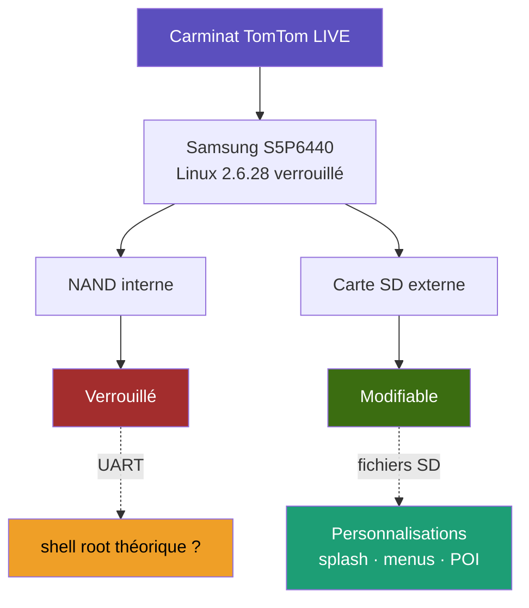

# Carminat TomTom LIVE: Reverse Engineering

> **Reverse engineering du NavCore 9.884 embarqué Renault (codename `beaumont`)**  
> Testé sur : Renault Laguna 3 GT Monaco GP 2012 (une superbe voiture, d'ailleurs)



---

## Table des matières

1. [Contexte et objectif](#1-contexte-et-objectif)
2. [Identification du système](#2-identification-du-système)
3. [Hardware](#3-hardware)
4. [Extraction du firmware](#4-extraction-du-firmware)
5. [Architecture du filesystem](#5-architecture-du-filesystem)
6. [Boot chain](#6-boot-chain)
7. [Processus et services](#7-processus-et-services)
8. [Analyse du binaire ttn](#8-analyse-du-binaire-ttn)
9. [Modem GPRS et connectivité](#9-modem-gprs-et-connectivité)
10. [Surface d'attaque depuis la carte SD](#10-surface-dattaque-depuis-la-carte-sd)
11. [Accès UART root](#11-accès-uart-root)
12. [Personnalisations sans UART](#12-personnalisations-sans-uart)
13. [Outils et ressources](#13-outils-et-ressources)
14. [Utilisation de l'IA dans ce projet](#14-utilisation-de-lia-dans-ce-projet)
15. [Disclaimer légal](#15-disclaimer-légal)

---

## 1. Contexte et objectif

Le **Carminat TomTom LIVE** est le système de navigation embarqué de Renault équipant les modèles 2009-2014 (Laguna 3, Mégane 3, Scénic 3, Espace 4, Fluence, Latitude, Koleos…). Il se distingue du Carminat TomTom non-Live par :

- Un firmware stocké sur **NAND interne** (et non sur la carte SD)
- Un modem **GPRS intégré** pour les services temps réel (trafic, météo, radars)
- Un bootloader **signé RSA** et verrouillé
- Selon les retours communautaires, un module kernel **`signedloop`** vérifierait l'intégrité du rootfs par arbre de Merkle (non confirmé par cette analyse, cf. §3)

Ce dépôt documente une analyse du firmware NavCore 9.884 beaumont, incluant la cartographie du filesystem, l'analyse statique du binaire NavCore, et l'analyse runtime via QEMU/strace.

**Méthodologie utilisée :**
- Identification du système via la **carte SD extraite du véhicule** (lecture des fichiers `ttgo.bif`, `loopdir/ext3_loopback`)
- Récupération du firmware via le **CDN officiel TomTom** (cf. section [Extraction du firmware](#4-extraction-du-firmware))
- Analyse statique du rootfs extrait du CAB
- **Mise en place d'un émulateur QEMU** reproduisant l'environnement ARM/Linux du boîtier pour permettre l'analyse dynamique du binaire `ttn` (strace des appels système, observation des fichiers ouverts, comportement runtime)

Aucune modification n'a été effectuée sur le boîtier physique du véhicule. Toutes les analyses ont été réalisées sur copies des fichiers de la SD et du firmware téléchargé.

**Tout le travail documenté ici a été effectué à partir d'une carte SD personnelle (extraite du véhicule pour analyse) et du firmware officiel téléchargé depuis le CDN TomTom.**

> 📌 **Document évolutif**: Ce rapport représente l'état actuel des connaissances issues de cette analyse. Il pourra être amélioré, corrigé ou enrichi au fil des découvertes futures, des contributions de la communauté, et des validations empiriques sur le hardware réel. Les contributions, corrections et retours sont les bienvenus.

---

## 2. Identification du système

| Champ | Valeur |
|---|---|
| **DeviceName** | TomTom Carminat LIVE |
| **Codename hardware** | `beaumont` (rev 11) |
| **NavCore version** | `9.884`, build `9.884.1609031` |
| **Release officielle** | `NFA2.8-RC06`, compilée le 27/06/2014 à Dieppe |
| **Kernel Linux** | `2.6.28.10-tt1574740` |
| **Toolchain** | `gcc 4.3.3 TomTom CipherWizardry 2009q1_203-474426` |
| **Libc** | uClibc |
| **Init system** | Upstart (via script shell `/sbin/init` → `exec /sbin/upstart`) |

Ces informations proviennent du `ttgo.bif` extrait de l'image `loopdir/ext3_loopback` de la carte SD, et du fichier `TomTom-Cfg/release.nfo`.

```ini
# Extrait ttgo.bif
[TomTomGo]
DeviceName=TomTom Carminat LIVE
DeviceVersionHW=beaumont
ApplicationVersionVersionNumber=9884
ApplicationVersion=1609031.550
RamDiskVersion=20140626
BootLoaderVersion=839378
LinuxVersion=1574740
```

---

## 3. Hardware

| Composant | Identification |
|---|---|
| **SoC** | Samsung S5P6440 (confirmé via `/etc/udev/rules.d/20_local-s5p6440.rules`) |
| **CPU** | ARM1176JZF-S · ARMv6 · little-endian · EABI |
| **RAM** | non déterminée par l'analyse statique |
| **Stockage interne** | NAND flash · eMMC (`/dev/mmcblk0`) |
| **Carte SD utilisateur** | `/dev/mmcblk1` (slot accessible) |
| **Écran** | LCD Samsung `LTA058B3L0F` (selon DTB) · 480×272 |
| **Framebuffer** | `/dev/fb0` · RGB16/24 |
| **GPS** | SiRF3 PRIMA · `/dev/ttySAC2` |
| **Modem GSM/GPRS** | Wavecom WISMO218 · `/dev/ttyS0` |
| **Tuner RDS-TMC** | BCM4750 · `bcm4750_spi` |
| **Bluetooth** | Intégré · `hci_uart` · HFP + PBAP uniquement (pas d'A2DP) |
| **Touchscreen** | `libts` · `/dev/input/event0` |

### Modules kernel chargés (extraits de `/etc/modules`)

```
unionfs · ppp_async · ppp_generic · slhc · hidp · hid · rfcomm
sco · hci_uart · l2cap · bluetooth · bcm4750_spi · vfat · msdos
fat · evdev
```

> ⚠️ Le module **`signedloop`** est rapporté par la communauté ([gpspower.net](https://www.gpspower.net/tomtom-tutorials/330988-tomtom-carminat-live-uart.html)) comme vérifiant l'intégrité de `rootfs.img`. **Non observé dans le rootfs extrait** (ni dans `/etc/modules`, ni dans `/lib/modules/2.6.28.10-tt1574740/`). À confirmer empiriquement.

---

## 4. Extraction du firmware

### 4.1 Téléchargement du CAB officiel

Le firmware est téléchargeable **sans authentification** depuis le CDN Akamai de TomTom :

```bash
curl -A "TomTom HOME/2.24.11.8" -O \
  "http://download.tomtom.com/sweet/navcore/9.884.1609031_RC06.CAB-Dieppe.cab"

# SHA256 de référence
a4d32daae2cdd6bc23a0660285c4e32e3a098034731eb257172ed7aaef9052d5
```

**Autres versions disponibles (testées HTTP 200) :**

| Version | URL |
|---|---|
| 9.844 | `http://download.tomtom.com/sweet/navcore/9844.634510.Carminat_TomTom.cab` |
| 9.845 RC10 | `http://download.tomtom.com/sweet/navcore/9.845_1115399_RC10.CAB-Camiron-RC10.cab` |
| 9.846 RC12 | `http://download.tomtom.com/sweet/navcore/9.846_1165624_RC12.CAB-Camiron-RC12.cab` |
| 9.847 RC14 | `http://download.tomtom.com/sweet/navcore/9.847.1302316_RC14.CAB-Camiron-RC14.cab` |
| **9.884 RC06** | `http://download.tomtom.com/sweet/navcore/9.884.1609031_RC06.CAB-Dieppe.cab` |

### 4.2 Extraction du CAB

```bash
brew install cabextract  # macOS
mkdir extracted && cabextract 9.884.1609031_RC06.CAB-Dieppe.cab -d extracted/
ls extracted/
# → splashw.bmp  ttsystem  TomTom-Cfg/release.nfo
```

> Le `ttsystem` est une **image ext2** (pas un TTBL), contrairement aux versions non-Live.

### 4.3 Extraction du rootfs complet

```bash
cd extracted/
mkdir rootfs && 7z x ttsystem -o rootfs/

# Le rootfs réel est dans userfs_partition.tar.gz
cd rootfs/
tar xzf userfs_partition.tar.gz

# Contenu :
# _zImage       → Linux kernel ARM zImage
# rootfs.img    → filesystem Linux complet (ext2, 67 MB)
# WISMO218_*.cla → firmwares modem

mkdir rootfs_mnt
# Sur Linux :
sudo mount -o loop rootfs.img rootfs_mnt/
# Sur macOS (lecture seule) :
7z x rootfs.img -o rootfs_mnt/
```

### 4.4 Structure du firmware extrait

```
rootfs_mnt/
├── bin/
│   ├── ttn          ← NavCore principal (11.7 MB, ELF ARM dynamique)
│   ├── telttn       ← wrapper IPC vers ttn
│   ├── fakettn      ← fallback si ttn absent
│   └── gprscomd     ← daemon GPRS
├── etc/
│   ├── inittab
│   ├── fstab
│   ├── passwd       ← root:Twu6z6F/voF0Q (DES crypt)
│   ├── init/jobs.d/ ← 20+ jobs Upstart
│   └── udev/
├── lib/
│   ├── libosal.so.0 ← TomTom OS Abstraction Layer
│   ├── libhal.so.0  ← Hardware Abstraction (pilote fb0)
│   ├── libttmp.so.0 ← TomTom Multimedia
│   └── LoquendoTTS/ ← moteur TTS Loquendo
├── sbin/
│   ├── init         ← script shell → exec /sbin/upstart
│   ├── mount_sd_loopback
│   ├── mount_sd
│   ├── run_gprscomd
│   └── ttsystem_present
└── (sur partition userfs au runtime)
    └── /mnt/sdcard/script/
        ├── TTTaskList.lua  ← liste complète des TASK_* (300+)
        └── liblua.so       ← VM Lua chargée par ttn via dlopen
```

---

## 5. Architecture du filesystem

### 5.1 Table des partitions eMMC (mmcblk0)

| Partition | Mountpoint | Type | Options |
|---|---|---|---|
| `mmcblk0p3` | `/mnt/flash` | ext3 | defaults,sync,noauto |
| `mmcblk0p5` | `/content` | ext3 | defaults,sync,noauto |
| (non fstab) | `/mnt/sdcard` | ext3 | mécanisme exact non vérifié |

> `/mnt/sdcard` est la **NAND interne**, pas la SD externe. C'est un héritage du naming TomTom où "sdcard" désignait le stockage embarqué. Le mécanisme exact de montage (probablement bootloader/initramfs en amont du shell `/sbin/init`) n'a pas été vérifié par cette analyse ; c'est suggéré par le `remount,rw` de `mount_internal` sur `/content` qui implique un montage préalable.

### 5.2 Carte SD externe (mmcblk1)

La SD est montée via `unionfs` sur `/mnt/movi` avec la configuration suivante :

```bash
# Script /sbin/mount_sd_loopback (simplifié)
sd_mount="/media/sdcard"        # FAT32, RO
loop_mount="/media/loopback"    # ext3_loopback, RW upper
union_mount="/mnt/movi"         # unionfs des deux

mount -t vfat /dev/mmcblk1p1 $sd_mount \
  -o rw,noatime,nodiratime,nosuid,nodev,noexec,sync

mount -o loop $sd_mount/loopdir/ext3_loopback $loop_mount \
  -o rw,noexec,data=journal,commit=3600,async

mount -t unionfs unionfs $union_mount \
  -o rw,async,noexec,dirs=$loop_mount:$sd_mount=ro
```

> ⚠️ **Double protection noexec** : option explicite dans `mount` sur la FAT32 + propagation unionfs. La communauté rapporte également un hook kernel `post_mount()` forçant `noexec` sur tout FS non-loop ([gpspower.net](https://www.gpspower.net/tomtom-tutorials/330988-tomtom-carminat-live-uart.html)): non vérifié dans cette analyse.

### 5.3 Contenu de la carte SD (FAT32)

```
/
├── splashw.bmp                  ← splash boot (480×272 24-bit BMP3)
├── autorun.inf                  ← Windows uniquement, ignoré par Linux
├── loopdir/
│   └── ext3_loopback            ← upper layer unionfs (15 MiB, ext3 RW)
│       ├── ttgo.bif             ← config runtime principale
│       ├── CurrentMap.dat       ← chemin carte courante
│       ├── UserPatch.dat        ← patches MapShare
│       └── Europe/
│           └── mapsettings.cfg  ← favoris, domicile, historique
├── Europe/                      ← carte TeleAtlas 2012.12 v905.4796
├── VAutoTTS/                    ← voix TTS Loquendo (~384 MB)
├── voices/                      ← voix pré-enregistrées .chk
├── ephem/                       ← éphémérides QuickGPSfix
├── photos/                      ← skins voiture BMP 480×272
├── art/cars/                    ← skins voiture 3D
├── sounds/                      ← klaxons et alertes WAV
├── raster/                      ← tuiles satellite JPEG
├── poi/                         ← radars premium .tlv
└── zones-dangereuses/           ← POI zones de danger FR
```

---

## 6. Boot chain

```
Mise sous tension
      │
      ▼
U-Boot (bootloader)
  Signé RSA-2048 · verrouillé
  Toute tentative Ctrl+C/ESC : ignorée
      │
      ▼
Kernel Linux 2.6.28.10-tt1574740
  (rapport communautaire : module signedloop
   vérifierait rootfs.img par Merkle tree, non vérifié)
      │
      ▼
/sbin/init (script shell)
  mount /proc /sys /dev /tmp /var
  mount /dev/pts
  mount /var/log
  mount /mnt/flash  (mmcblk0p3, ext3)
  ifconfig lo 127.0.0.1
  exec /sbin/upstart
      │
      │  /content est monté plus tard par mount_internal
      │  (via service_mount_userfs : remount,rw)
      ▼
Upstart state machine
  state_initial
    └── service_udevd, service_apm
    └── modprobe /etc/modules
    └── state_initial_finished
          │
          ▼
        state_boot_mode_select
          USB détecté ? ──yes──→ state_mass_storage
          non ──────────────→ state_check_for_updates
                                    │
                    ┌───────────────┼───────────────┐
                    ▼               ▼               ▼
           /mnt/movi/ttsystem  loadmodem    ttntools/ttntool.sh
           (valid_update)      (modem upd)  (factory_tool)
                    │
                    ▼ (aucun des triggers)
              state_navcore
                └── service_gps (clmapp/glgps)
                └── service_ttn_beaumont
                      ├── si /mnt/sdcard/ttn existe → exec celui-là
                      ├── sinon /bin/ttn
                      └── sinon /bin/fakettn
```

### Triggers de la carte SD dans `state_check_for_updates`

| Fichier sur SD | Événement Upstart | Effet |
|---|---|---|
| `/mnt/movi/ttsystem` | `valid_update_found` | Reboot en mode flash |
| `/mnt/sdcard/loadmodem` | `ttmodem_update_found` | Update firmware WISMO218 |
| `/mnt/sdcard/ttntools/ttntool.sh` | `factory_tool_found` | Exec root du script (NAND interne) |
| `/sbin/sirfimg.ver` ≠ `/content/sirffirmwaupdated.dat` | `sirf_update_found` | Update firmware GPS SiRF |
| aucun | `no_valid_update_found` | Boot navcore normal |

> ⚠️ `/mnt/sdcard/ttntools/ttntool.sh` est sur la **NAND interne**, pas sur ta SD physique.

---

## 7. Processus et services

### Jobs Upstart complets (`/etc/init/jobs.d/`)

| Job | Rôle |
|---|---|
| `state_initial` | Init udev + modules |
| `state_boot_mode_select` | Détection USB/navcore |
| `state_check_for_updates` | Tests fichiers SD |
| `state_navcore` | Lance ttn + GPS |
| `state_mass_storage` | Mode USB gadget |
| `state_factory_tool` | `exec /mnt/sdcard/ttntools/ttntool.sh` |
| `service_ttn_beaumont` | Lance `/bin/ttn` |
| `service_gps` | GPS (clmapp ou glgps) |
| `service_gprs_beaumont` | GPRS daemon |
| `service_console` | getty sur ttySAC0 |
| `service_bluetooth` | Bluetooth stack |
| `service_coldbootcounter` | Compteur boots sur NAND interne (`/mnt/sdcard/counter.coldboot`) |
| `change_handler` | Machine à états Upstart |
| `task_insert_sdcard` | Mount SD + ttevent mounted |

### Règles udev (`/etc/udev/rules.d/`)

`10_local.rules`, gestion SD :
```
KERNEL=="mmcblk?", ACTION=="add", RUN+="/sbin/ttevent inserted &"
KERNEL=="mmcblk?", ACTION=="add", RUN+="/sbin/emit_sd_detected"
KERNEL=="mmcblk?", ACTION=="remove", RUN+="/sbin/emit_sd_removed"
```

`20_local-s5p6440.rules`, gestion USB gadget et GPS :
```
KERNEL=="s3c-usbgadget", ACTION=="add", RUN+="/sbin/load_g_file_storage"
KERNEL=="ttyBCM0", ACTION=="add", SYMLINK+="ttyBCM0 gpsdevice"
```

---

## 8. Analyse du binaire `ttn`

**Fichier** : `/bin/ttn` · 11 714 356 octets · ELF 32-bit LSB ARM EABI5 · dynamique · stripped

### Dépendances

```
ld-linux.so.3 · libc.so.6 · libpthread · librt · libdl · libm
libstdc++.so.6 · libgcc_s · libasound.so.2 · libts-0.0.so.0
libosal.so.0 · libhal.so.0 · libttmp.so.0 · libhf.so
LoquendoTTS/libLoqTTS7.so · LTTS7AudioBoard.so
pphwre.so · vautov5.so
```

### Plugins chargés via `dlopen` au runtime

```
/mnt/sdcard/setup.so          ← point d'entrée setup()
/mnt/sdcard/script/liblua.so  ← VM Lua
```

### Fichiers lus depuis la SD (strace QEMU)

```
/mnt/sdcard/setup.so          → ENOENT au boot
/mnt/sdcard/newsettings.dat   → ENOENT
/mnt/sdcard/cleanup.txt       → ENOENT
/mnt/sdcard/fleetecd/ttw.bif  → ENOENT
/mnt/sdcard/randomized_zone_country.dat → ENOENT
/mnt/sdcard/data.chk          → ENOENT
/dev/fb0                      → ouvert avec succès (O_RDWR)
/dev/input/event0             → ouvert avec succès
```

### Marker files reconnus par ttn

Placés dans `/mnt/sdcard/` (NAND interne) ou `/mnt/movi/` selon le fichier :

| Fichier | Effet |
|---|---|
| `framerate.txt` | Affiche le FPS à l'écran |
| `noautosuspend.dat` | Désactive la mise en veille |
| `nowatchdog` | Désactive le watchdog |
| `noautosuicide.dat` | Désactive le suicide watchdog |
| `coredumpsenable.dat` | Active les core dumps |
| `salesdemo.script` | Mode démo commercial |
| `debugsigusr.dat` | Signal debug USR |
| `TTExceptiontrace.dat` | Trace des exceptions |
| `routeprofiler.dat` | Profiler de routes |
| `coldbootcounter` | Compteur incrémenté au boot (sur `/mnt/movi/`) |
| `restart.dat` | Détecté post-crash |

### Classes C++ importantes (symboles démanglés)

```cpp
// Framebuffer (libhal.so)
MLinuxScreen::SwitchFrameBuffer()
MLinuxScreen::ClearFrameBufferScreen()
MLinuxScreen::GetFrameBufferByteCount()

// SDK / Menu
CSDKRequestHandler
CMicroBrowserSDKController::RunSDKCommand(const char*, const char*&)
CScriptSDKCommand::Execute(CScriptManager&)
CFileManager::PDLegacySDKRegistry(Tbuf<512>&)

// HMAC (ValueRatio = HMAC-SHA1 tronqué 80 bits)
HMACSha1_80
Sha1
MD5_CTX

// Services réseau
CHerculesServicesManager::SetServerURL(Tptr&)
CServiceDiscovery::SetServiceDiscoveryData(PKh, j)
CScriptDownload::ExecuteRemote()  ← download script HTTP
```

### Liste complète des TASK_* (extrait `TTTaskList.lua`)

Le fichier `TTTaskList.lua` (présent au runtime sur la partition userfs, chargé via la VM Lua par `ttn`) contient les 300+ tâches disponibles pour `SdkRegistry/tomtom.mnu`. Exemples clés :

```lua
TASK_BROWSE_MAP = 700000
TASK_MICROBROWSER = 708001      -- navigateur HTML embarqué
TASK_IMAGE_BROWSER = 19778      -- visionneuse images
TASK_DOC_BROWSER = 197782
TASK_DARK_SCREEN = 6000200      -- écran noir
TASK_PREFERENCES = 19507
TASK_NAVIGATE_TO_FREQUENT_DESTINATION = 850025
```

---

## 9. Modem GPRS et connectivité

### Configuration

```bash
# APN hardcodé dans /bin/gprscomd
APN: tomtom.m2m.ch    ← SIM TomTom LIVE (désactivée)

# Fichiers de config
/mnt/flash/sysfile/gprsantennatype   ← type d'antenne
/mnt/sdcard/gprsstamp                ← timestamp dernier sync
/mnt/sdcard/datausage.txt            ← compteur data
/etc/ppp/peers/gprscom.options       ← généré runtime
```

### URLs serveurs (hardcodées dans ttn)

```
http://t.tt1.nl/services/directory.php   ← bootstrap services LIVE
http://t.tt1.nl/proxy/directory.php      ← proxy LIVE
```

Le flow de service discovery :
1. Boot → GET `http://t.tt1.nl/services/directory.php`
2. Réponse = liste des vrais serveurs (Hercules, Weather, Traffic…)
3. `CHerculesServicesManager::SetServerURL()` mémorise les URLs
4. URLs cachées dans `ttgo.bif` pour les boots suivants

> Les services LIVE TomTom ont été arrêtés. La SIM intégrée est probablement désactivée côté opérateur.

### Override GPRS (nécessite accès NAND)

```bash
# /sbin/run_gprscomd (simplifié)
gprscmdline="/mnt/sdcard/gprscomd.cmdline"
if [ -x ${gprscmdline} ] ; then
    gprsexecutable="`tail -n 1 ${gprscmdline}`"
fi
exec ${gprsexecutable} -i
```

Si `/mnt/sdcard/gprscomd.cmdline` est exécutable et que sa dernière ligne pointe vers un binaire custom → **RCE root au boot**. Nécessite accès write à `/mnt/sdcard/` (NAND interne).

---

## 10. Surface d'attaque depuis la carte SD

### ✅ Faisable sans UART

#### 1. Splash screen custom

Remplacer `/splashw.bmp` à la racine FAT32 de la SD :
- Format présent dans la SD : **BMP Windows 3.x · 480×272 · 24 bits**
- Emplacement utilisé par le système (selon analyse du firmware)
- Non testé empiriquement

#### 2. Menu UI custom via `SdkRegistry`

Créer `SdkRegistry/tomtom.mnu` à la racine de la SD. La feature `SDK` apparaît dans le champ `Features=` du `ttgo.bif` extrait. Son activation runtime sur le boîtier reste à confirmer empiriquement.

```
BLOCK_MAIN
MENUITEM|TASK_BROWSE_MAP|Carte|map.bmp
MENUITEM|TASK_MICROBROWSER|Browser|web.bmp
MENUITEM|TASK_PREFERENCES|Réglages|prefs.bmp
MENUITEM|TASK_DARK_SCREEN|Écran noir|dark.bmp
BTM_DONE
```

> ⚠️ Le nom exact du dossier est `SdkRegistry` (sans underscores). Le fichier est `tomtom.mnu` (minuscules). Confirmé dans les strings du binaire `ttn`.

#### 3. Override de settings

Créer `overridesettings.ini` sur la SD. La feature `SettingsOverride` apparaît dans le `ttgo.bif` :
- Format INI, clés à reverser depuis les strings de `ttn`
- Override potentiel de comportements sans modifier `ttgo.bif` (évite le piège `ValueRatio`)
- Comportement runtime non testé

#### 4. POI et zones de danger custom

Format OV2 standard TomTom :
```
Europe/mes_poi.ov2   ← données de position
Europe/mes_poi.bmp   ← icône 22×22
Europe/mes_poi.ogg   ← alerte audio
```

#### 5. Voix custom

Remplacer un voice pack dans `voices/` (format `.chk` = OGG Vorbis encapsulés).

### ❌ Impossible sans UART

- Exécuter un binaire ARM depuis la SD (double noexec + hook kernel non vérifié)
- Charger une lib `.so` depuis `/mnt/movi/` via dlopen (mmap PROT_EXEC bloqué)
- Modifier le rootfs (RSA bootloader + protection rootfs rapportée par la communauté)
- Accéder à `ttntool.sh` depuis la SD physique (`/mnt/sdcard` ≠ SD externe)
- Re-flasher un CAB modifié (signature RSA-2048)

---

## 11. Accès UART root

> ⚠️ **Section non vérifiée** : les informations ci-dessous proviennent de l'analyse statique du firmware et de retours communautaires (forum gpspower.net). Aucun test UART physique n'a été effectué sur le boîtier. Les pads exacts, le baudrate et le comportement réel du shell restent à confirmer.

### Credentials extraits du firmware

```
/etc/passwd : root:Twu6z6F/voF0Q:0:0:root:/mnt/sdcard:/bin/sh

Hash type   : DES crypt (Unix classique)
Sel         : Tw
Mot de passe: palmtop1
Home dir    : /mnt/sdcard (NAND interne, pas la SD physique)
Shell       : /bin/sh
```

> Hash extrait du firmware officiel `9.884.1609031_RC06.CAB-Dieppe.cab`, cracké avec john + rockyou.txt. Le mot de passe `palmtop1` est présent dans le firmware public mais sa validité runtime sur un boîtier réel reste à vérifier.

### Matériel supposé nécessaire

D'après les retours de la communauté ([gpspower.net](https://www.gpspower.net/tomtom-tutorials/330988-tomtom-carminat-live-uart.html)) :

- Câble **USB-TTL 3.3V** (CH340 ou CP2102)
- Pinces test point ou pogo pins

### Paramètres série supposés

```
Baudrate : 115200
Data     : 8 bits
Parity   : None
Stop     : 1 bit
→ 115200 8N1
```

Les pads UART (TX/RX/GND) sur le PCB beaumont sont mentionnés sur gpspower.net avec photos. Localisation exacte à confirmer sur le hardware physique.

### Terminal (macOS/Linux)

```bash
screen /dev/ttyUSB0 115200
# ou
minicom -D /dev/ttyUSB0 -b 115200
```

### Commandes possibles après connexion (théorique)

```bash
# Vérifier l'accès
whoami && uname -a

# Voir tous les filesystems montés
cat /proc/mounts

# Accéder au framebuffer
ls -la /dev/fb0
cat /proc/fb

# Remonter la NAND en RW
mount -o remount,rw /mnt/sdcard

# Voir les modules kernel
lsmod
cat /proc/modules | grep signedloop
```

### Vecteurs théoriquement débloqués par UART

Sur la base de l'analyse statique des scripts et du binaire, **si** l'accès root via UART fonctionne :

| Action | Mécanisme observé dans le firmware |
|---|---|
| **Remplacement complet du NavCore** | `service_ttn_beaumont` exécute `/mnt/sdcard/ttn` en priorité s'il existe (avant `/bin/ttn`) |
| Exec custom au boot | `state_factory_tool` exécute `/mnt/sdcard/ttntools/ttntool.sh` |
| RCE GPRS | `/sbin/run_gprscomd` lit `/mnt/sdcard/gprscomd.cmdline` si `-x` |
| Plugin NavCore | `ttn` fait `dlopen("/mnt/sdcard/setup.so")` au démarrage |
| Affichage fb0 | `/dev/fb0` ouvert avec succès dans le strace QEMU |

> Le vecteur `/mnt/sdcard/ttn` est le plus puissant : il remplace l'application principale qui tourne en root et monopolise le framebuffer. Aucun de ces vecteurs n'a été confirmé fonctionnel sur un boîtier réel.

---

## 12. Personnalisations sans UART

### Structure SD recommandée

```
SD:/
├── splashw.bmp                    ← Boot screen custom (480×272 24-bit)
├── SdkRegistry/
│   └── tomtom.mnu                 ← Menu UI custom
├── overridesettings.ini           ← Override settings
├── Europe/
│   ├── mes_poi.ov2                ← POI personnalisés
│   ├── mes_poi.bmp                ← Icône POI
│   └── mes_poi.ogg                ← Alerte sonore
├── zones-dangereuses/             ← Radars FR (format OV2)
└── loopdir/
    └── ext3_loopback              ← À modifier avec R-Link Explorer
        ├── ttgo.bif               ← Config (attention: ValueRatio)
        └── Europe/
            └── mapsettings.cfg    ← Favoris et préférences
```

### Outils nécessaires

| Outil | Usage | Plateforme |
|---|---|---|
| **R-Link Explorer 1.4** (Djeman) | Lecture/écriture ext3_loopback | Windows/Wine |
| `cabextract` | Extraction du CAB firmware | macOS/Linux |
| `7z` | Extraction ext2/ext3 | Multiplateforme |
| `john` / `hashcat` | Crack hash DES | Multiplateforme |
| `arm-linux-gnueabihf-gcc` | Compilation binaires ARM | macOS/Linux |
| `strace` | Analyse runtime dans QEMU | Linux |
| **Ghidra** | Reverse engineering `ttn` | Multiplateforme |

---

## 13. Outils et ressources

### Repos GitHub utiles

- [cedricp/ddt4all](https://github.com/cedricp/ddt4all): Diagnostic OBD Renault
- [george-hopkins/opentom](https://github.com/george-hopkins/opentom): Outils TomTom RE
- [raulbalanza/OpenTom](https://github.com/raulbalanza/OpenTom): Fork OpenTom récent

### Forums de référence

- [gpspower.net: Carminat LIVE UART](https://www.gpspower.net/tomtom-tutorials/330988-tomtom-carminat-live-uart.html): Accès UART, noexec, rootfs
- [navitotal.com: Carminat Live patching](https://www.navitotal.com/general-discussions-about-tomtom/carminat-live-navcore-844-patching-and-map-activation-t7180-165.html)
- [gpsurl.com: Cracking the non-Live Carminat](https://www.gpsurl.com/tomtom-discussions/187882-cracking-live-carminat-17.html)
- [gps-carminat.com](https://www.gps-carminat.com): Référence francophone
- [forumlaguna3.com](https://www.forumlaguna3.com)

### Compiler pour ARM1176JZF-S / S5P6440 (macOS)

```bash
brew install arm-linux-gnueabihf-gcc

# Cross-compilation pour ARMv6 (S5P6440)
arm-linux-gnueabihf-gcc -static -march=armv6 \
  -o fbtest fbtest.c

# Note: ARMv5 (-march=armv5tej) reste compatible mais sous-optimal
```

---

## 14. Utilisation de l'IA dans ce projet

Par souci de transparence, je tiens à préciser que **Claude (Anthropic)** a été utilisé comme outil d'assistance tout au long de ce projet de reverse engineering.

**Ce que l'IA a apporté :**
- Aide à la recherche et à l'orientation sur certains points techniques (mécanismes Upstart, format des binaires TomTom, conventions Linux embarqué)
- Accélération de l'exploration du firmware en suggérant des pistes à creuser
- Rédaction et mise en forme propre du présent README à partir de mes notes et découvertes

**Ce qui reste de mon fait :**
- L'ensemble de la démarche et la direction du projet
- Le travail concret d'extraction, d'analyse et de tests
- La validation et la vérification de chaque information avant publication
- Les choix éditoriaux et techniques

L'IA a été un assistant pour gagner du temps et structurer le travail, mais l'investigation reverse engineering elle-même a été menée par mes soins. Ce projet n'aurait pas existé sans cette assistance, mais l'IA seule ne l'aurait pas produit non plus.

---

## 15. Disclaimer légal

Ce travail de reverse engineering a été effectué **exclusivement sur un appareil personnel** (Renault Laguna 3 Monaco GP 2012) à des fins de recherche et de documentation communautaire.

- Le firmware CAB est téléchargeable sans authentification depuis les serveurs officiels TomTom (Akamai CDN)
- Aucune protection technique n'a été contournée pour obtenir ce firmware
- Ce dépôt ne contient aucune carte TomTom piratée ni aucun bypass de DRM
- L'utilisation de ces informations sur un appareil qui ne vous appartient pas est de votre responsabilité

Le RE de logiciel à des fins d'interopérabilité et de recherche est encadré par la Directive européenne 2009/24/CE (art. 6) et son équivalent en droit français.

---

*Documentation du NavCore 9.884 beaumont basée sur l'analyse statique du firmware officiel*
